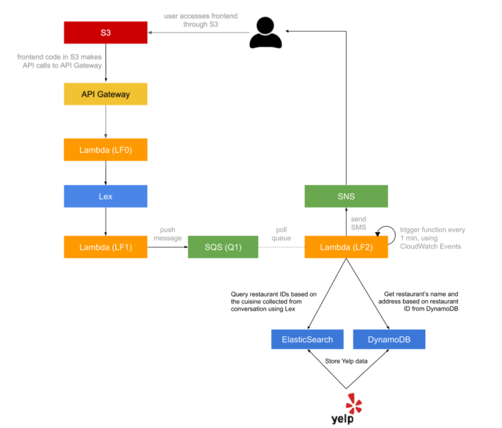

# dining-chatbot
## Introduction
* A serverless, movroservice-driven web application hosted on AWS S3
* [Chatbot link](https://dining-chatbot-kshih.s3.amazonaws.com/index.html)
* Available Location:
    * New York
* Available Cuisine Type:
    * Indian
    * Chinese
    * Japanese
    * French
    * Korean

## Workflow
- **User: Hi**
- Bot: Hi there, how can I help?
- **User: I need some restaurant suggestions.**
- Bot: Where do you want to dine in?
- **User: Manhattan**
- Bot: What cuisine would you like to try?
- **User: Japanese**
- Bot: Ok, how many people are in your party?
- **User: Two**
- Bot: What time?
- **User: 7 pm**
- Bot: Great. Lastly, I need your phone number so I can send you my findings.
- **User: 123-456-7890**
- Bot: You’re all set. Expect my suggestions shortly! Have a good day.
- **User: Thank you!**
- Bot: You’re welcome.

## Architecture Diagram
- 
